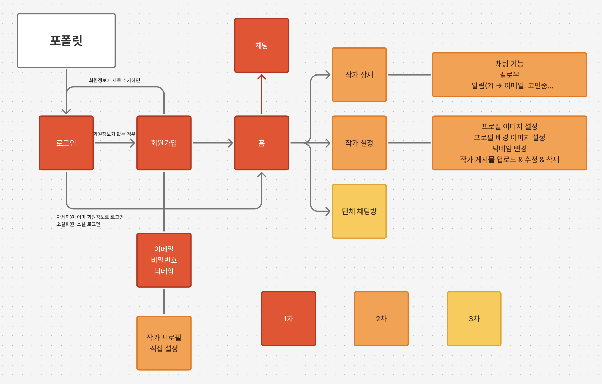

> **[📂process](https://github.com/Pofolit/.github/process.md)**  
> **[📂Frontend repo](https://github.com/Pofolit/pofolit_fe)**  
> **[📂Backend repo](https://github.com/Pofolit/pofolit_be)**  
> **[📂Meta repo](https://github.com/Pofolit/.github)**

`📂.github/docs/`: 공통 문서  
`📂.github/images/`: 이미지 소스

---

 
프론트 페이지 구성

---
